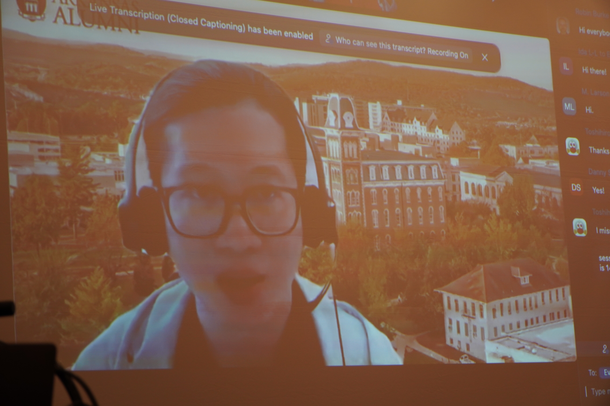

About 30 in-person and 30 on-line attendees have joined the workshop has held successfully.

Thanks for all presenters and attendees.

The 5th FAccTRec Workshop on Responsible Recommendation at [RecSys 2022](https://recsys.acm.org/recsys22/) is a venue for discussing problems of social responsibility in building, maintaining, evaluating, and studying recommender systems, including but not limited to issues of fairness, accountability, and transparency (FAccT).
The importance of these problems are now increasing due to the empowerment of social networking technologies and the change of social environment, such as the enforcement of the EU General Data Protection Regulation and broader awareness of social issues in information distribution.
In this workshop, we welcome research and position papers about ethical, social, and legal issues raised by the development and the use of recommendation.
The workshop will include presentations of these papers and discussion on a research agenda for socially responsible recommendation.

## What's New

* 2022-09-17: [workshop program]({{ "/program/" | relative_url }})
* 2022-08-05: deadline extension!
* 2022-06-03: open [submission site](https://easychair.org/conferences/?conf=facctrec2022)
* 2022-04-27: opening this site

## Important Dates

- 2022-08-05: Paper submission deadline
- 2022-08-08: Abstract registration
- 2022-08-11: Paper submission
- 2022-08-27: Author notification
- 2022-09-10: Final version upload
- 2022-09-23: Workshop

TIMEZONE: Anywhere On Earth (UTC-12)

## FAccT Network

The FAccTRec 2022 workshop is proudly a part of the [FAccT network](https://facctconference.org/network/), to publish and engage with fairness, accountability, and transparency scholars across connected disciplines.
